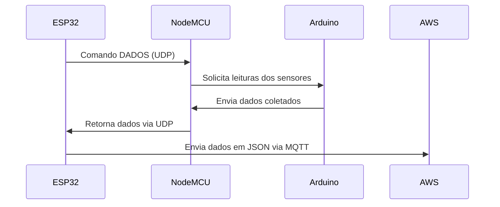
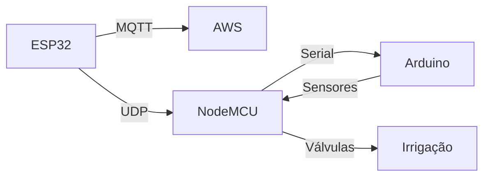

# PythoFlow - Sistema de Irrigação Automática

## Visão Geral
Bem-vindo ao repositório do PythoFlow, um sistema integrado para controle automático de irrigação baseado em dados ambientais. Este README descreve a arquitetura embarcada do sistema, abordando como dispositivos ESP32, ESP8266 e Arduino interagem com sensores e a nuvem AWS.

## Funcionalidades

### 1. Coleta e Envio de Dados Ambientais
- **Processo Geral**:
  1. O ESP32 envia um comando `DADOS` via UDP para todos os dispositivos da rede.
  2. Os NodeMCUs conectados aos Arduinos leem dados dos sensores.
  3. Os dados coletados são estruturados em formato JSON pelo ESP32 e enviados à AWS via MQTT.

- **Sensores Utilizados**:
  - **HL-69**: Umidade do solo.
  - **DS18B20**: Temperatura do solo.
  - **DHT22**: Umidade e temperatura do ar.
  - **Fotoresistor**: Intensidade da luz.
  - **GUVA-S12SD**: Índice de radiação UV.

#### Exemplo de Fluxo de Dados


### 2. Controle de Irrigação
- **Processo Geral**:
  1. O ESP32 recebe comandos da AWS para ativar a irrigação.
  2. Identifica o dispositivo alvo baseado no endereço IP e ID.
  3. Envia comandos para o NodeMCU correspondente, que aciona a válvula solenóide.

- **Fluxo de Comando**:


## Arquitetura do Sistema

### Componentes
1. **ESP32**:
   - Centraliza o controle do sistema.
   - Gerencia a comunicação com a AWS.
   - Orquestra comandos na rede local.

2. **ESP8266 (NodeMCU)**:
   - Interage com os Arduinos e ESP32.
   - Lê dados de sensores e aciona válvulas.

3. **Arduino**:
   - Lê sensores analógicos e digitais.
   - Fornece dados ao NodeMCU.

### Diagrama de Blocos


## Requisitos

### Hardware
- ESP32.
- NodeMCU (ESP8266).
- Arduino Uno ou similar.
- Sensores (HL-69, DS18B20, DHT22, GUVA-S12SD, Fotoresistor).
- Válvulas solenóides.

### Software
- IDE Arduino.
- Biblioteca MQTT.
- Configuração de rede Wi-Fi.

## Como Usar

1. **Configurar o Hardware**:
   - Conecte os sensores ao Arduino conforme o esquemático.
   - Configure os NodeMCUs para se comunicarem via serial com os Arduinos.

2. **Deploy do Código**:
   - Compile e carregue o firmware nos ESP32, NodeMCUs e Arduinos.

3. **Executar o Sistema**:
   - Ligue os dispositivos.
   - O ESP32 iniciará a comunicação e sincronizará com a AWS.

## Exemplos de Uso

### JSON Enviado para a AWS
```json
[
  {
    "identifier": "A1",
    "values": {
      "umidity": 60.2,
      "temperature": 28.3,
      "soil_humidity": 45.1,
      "light": 700,
      "uv_intensity": 2.5
      "soil_temperature": 22.3,
    }
  }
]
```

### Comando de Irrigação Recebido
```json
{
  "identifier": "A1",
  "comand": "AGOAR",
  "time": 120000
}
```

## Considerações
- **Segurança**: Uso de autenticação MQTT.
- **Escalabilidade**: Suporte para novos dispositivos na rede.
